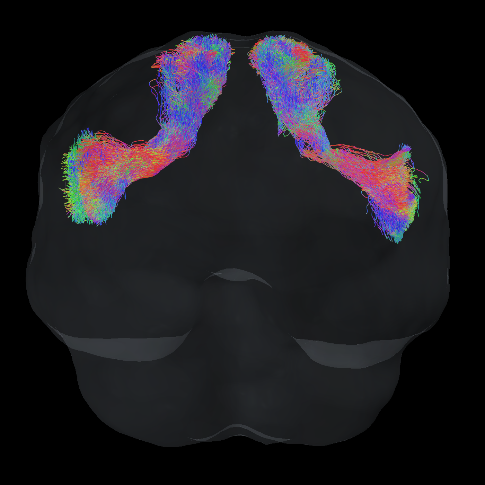

# Frontal Aslant Tract reconstruction

**Workflow author: Lucius Fekonja** · [GitHub: LucSam](https://github.com/LucSam)

Reconstruct the Frontal Aslant Tract (FAT) from individual white-matter FODs
and a brain-extracted T1, using HCP1065 atlas masks and anatomical cortical targets.
Each successful reconstruction contains **2000 complete streamlines per side**,
inside the processed bundle mask.

[](https://LucSam.github.io/tractseg_xtract_fat/)

[**Open the 3D viewer**](https://LucSam.github.io/tractseg_xtract_fat/) · Rotate, zoom,
and compare iFOD2, SD_STREAM, FACT, Tensor_Det and Tensor_Prob.

`fat_simple.sh` is a standalone script with its preparation and validation code
embedded. The atlas downloads automatically on first use. The current workflow
uses HCP1065; the repository retains its original name.

## Table of contents

- [Install](#install)
- [How to use](#how-to-use)
- [Tracking algorithms](#tracking-algorithms)
- [FAQ](#faq)
- [Method and scope](#method-and-scope)
- [Advanced options](METHODS.md)
- [Validation](VALIDATION.md)
- [Attribution and references](#attribution)

## Install

Use a **Bash or Zsh terminal on macOS or Linux**. The Linux installation route
below is for x86_64. On Windows, first set up
[WSL with Ubuntu](https://fsl.fmrib.ox.ac.uk/fsl/docs/install/windows.html), then use
its Linux terminal. The workflow has been exercised locally on macOS; the
instructions for other systems follow the upstream projects' installation guides.

Run one code block at a time. Skip installation steps for software you already
have. Steps 1–5 are one-time setup; repeat steps 6–8 for another subject.

### 1. Install Conda if needed

If `conda --version` already works, use that Conda installation and skip the
installer block. Otherwise install [Miniforge](https://github.com/conda-forge/miniforge)
with the following commands; the installer is selected for your computer:

```bash
mkdir -p "$HOME/Downloads/fat_setup"
cd "$HOME/Downloads/fat_setup"
case "$(uname -s)" in
  Darwin) FAT_PLATFORM=MacOSX ;;
  Linux) FAT_PLATFORM=Linux ;;
esac
curl -L --fail -o Miniforge3.sh \
  "https://github.com/conda-forge/miniforge/releases/latest/download/Miniforge3-${FAT_PLATFORM}-$(uname -m).sh"
bash Miniforge3.sh -b -p "$HOME/miniforge3"
source "$HOME/miniforge3/etc/profile.d/conda.sh"
```

This creates `~/miniforge3`. If that directory already exists, use the existing
installation instead of running its installer again.

### 2. Create the FAT environment: Python and ANTs

```bash
conda create -n fat --override-channels -c conda-forge \
  python=3.12 numpy nibabel scipy ants git curl
conda activate fat
```

Confirm Conda's proposed installation when prompted. This environment supplies
the Python packages and ANTs registration commands, including
`antsRegistrationSyNQuick.sh` and `antsApplyTransforms`.
[ANTs conda package](https://github.com/conda-forge/ants-feedstock)

### 3. Install MRtrix3

Choose the block for your operating system. If `mrinfo -version` and
`tckgen -version` already work in the active `fat` environment, continue to step 4.

**Linux x86_64:** install the official MRtrix3 Conda package into `fat`:

```bash
conda install -n fat --override-channels -c conda-forge -c MRtrix3 \
  mrtrix3 libstdcxx-ng
```

[Official Linux instructions](https://www.mrtrix.org/download/linux-anaconda/)

**macOS:** use MRtrix3's application installer. Download the installer, then run
it; `sudo` requests your Mac administrator password:

```bash
mkdir -p "$HOME/Downloads/fat_setup"
curl -L --fail -o "$HOME/Downloads/fat_setup/install_mrtrix3" \
  https://raw.githubusercontent.com/MRtrix3/macos-installer/master/install
sudo bash "$HOME/Downloads/fat_setup/install_mrtrix3"
export PATH="$PATH:/usr/local/bin"
```

It installs command-line tools and MRview. Afterwards, reactivate the environment
so its Python remains first on `PATH`:

```bash
conda activate fat
mrinfo -version
tckgen -version
```

[Official macOS instructions](https://www.mrtrix.org/download/macos-application/)

### 4. Install FSL and its cortical atlas

An existing FSL installation containing Harvard-Oxford and the standard MNI152
T1 template is sufficient. Otherwise, use the official installer:

```bash
mkdir -p "$HOME/Downloads/fat_setup"
curl -L --fail -o "$HOME/Downloads/fat_setup/getfsl.sh" \
  https://fsl.fmrib.ox.ac.uk/fsldownloads/fslconda/releases/getfsl.sh
sh "$HOME/Downloads/fat_setup/getfsl.sh" "$HOME/fsl"
```

Wait for `FSL successfully installed`. This is a larger download than the FAT
atlas. FSL is installed separately from the `fat` Conda environment. The command
above uses `~/fsl`; use your actual installation directory below if different.
[Official Linux guide](https://fsl.fmrib.ox.ac.uk/fsl/docs/install/linux.html),
[official macOS guide](https://fsl.fmrib.ox.ac.uk/fsl/docs/install/macos.html)

Set up FSL for the current terminal, then reactivate `fat`:

```bash
export FSLDIR="$HOME/fsl"
source "$FSLDIR/etc/fslconf/fsl.sh"
conda activate fat
```

For a **new terminal session**, load your Conda shell setup, then run the three
lines above again. For the Miniforge installation in step 1, the shell setup is:

```bash
source "$HOME/miniforge3/etc/profile.d/conda.sh"
```

With an existing Miniconda/Anaconda installation, use its shell setup instead.
There is no need to reinstall the packages for another subject.

### 5. Download this workflow and check dependencies

```bash
mkdir -p "$HOME/code"
cd "$HOME/code"
git clone https://github.com/LucSam/tractseg_xtract_fat.git
cd tractseg_xtract_fat
```

If you already cloned it, enter the existing folder and run `git pull --ff-only`.
Then check the installation before starting a reconstruction:

```bash
python3 - <<'PY'
import os
import shutil
from pathlib import Path
import nibabel
import numpy
import scipy

commands = ["bash", "curl", "mrinfo", "mrconvert", "sh2peaks", "tckgen", "tckinfo",
            "antsRegistration", "antsRegistrationSyNQuick.sh", "antsApplyTransforms"]
missing = [name for name in commands if shutil.which(name) is None]
assert not missing, "Commands missing from PATH: " + ", ".join(missing)
assert os.environ.get("FSLDIR"), "Set FSLDIR in step 4."
fsl = Path(os.environ["FSLDIR"])
for relative in ["data/atlases/HarvardOxford-Cortical.xml",
                 "data/atlases/HarvardOxford/HarvardOxford-cort-maxprob-thr25-1mm.nii.gz",
                 "data/standard/MNI152_T1_1mm_brain.nii.gz"]:
    assert (fsl / relative).is_file(), f"Missing FSL file: {fsl / relative}"
print("Dependencies and FSL atlas files OK.")
print(f"NumPy {numpy.__version__}; NiBabel {nibabel.__version__}; SciPy {scipy.__version__}")
PY
```

Continue after `Dependencies and FSL atlas files OK.` No HCP atlas files are
needed at this point; they are downloaded in step 7.

## How to use

### 6. Prepare your input folder

The required files are:

```text
subject01/mri/
  wm.nii.gz          # MRtrix white-matter FOD spherical-harmonic coefficients
  t1_brain.nii.gz    # brain-extracted T1 from the same individual
```

**`wm.nii.gz` must contain FOD coefficients, not a binary white-matter mask.**
Start from your existing diffusion preprocessing/FOD pipeline. This workflow
does not estimate FODs from raw DWI or perform skull stripping. If your FOD is
already `wm.mif`, convert it once:

```bash
mrconvert /absolute/path/to/wm.mif /absolute/path/to/subject01/mri/wm.nii.gz
```

Place the brain-extracted T1 in that same folder as `t1_brain.nii.gz`. T1 and FOD
images can have different grids: the workflow registers them. Peaks and a
separate binary WM mask are not required by `fat_simple.sh`.

**Edit this path to your own input folder**, then check its dimensions and files:

```bash
export IN="/absolute/path/to/subject01/mri"
bash tractseg_xtract_fat.sh check "$IN"
mrinfo "$IN/t1_brain.nii.gz" -size
```

Expect `Input dimensions and grids OK.` and three dimensions for the T1.

### 7. Run the reconstruction

From the repository directory:

```bash
export OUT="$IN/fat_output"
export ATLAS_DIR="$HOME/.cache/tractseg_xtract_fat/hcp1065"
IN="$IN" OUT="$OUT" ATLAS_DIR="$ATLAS_DIR" bash fat_simple.sh > "$IN/fat_run.log" 2>&1
```

`OUT` must be a new directory. This runs iFOD2, SD_STREAM and FACT for each side. Progress and errors are written to `fat_run.log`.
In another terminal you can view progress with
`tail -f /absolute/path/to/subject01/mri/fat_run.log`.

The script downloads the
HCP1065 probability archive and ICBM2009a template archive (about **77 MB** total),
checks their SHA-256 hashes and extracts the two FAT maps and template files.
The cache is shared between subjects. Further runs can use it offline. The
Harvard-Oxford cortical atlas comes from your FSL installation in step 4.
The script estimates this subject's registration transforms automatically.

On completion, check the success marker:

```bash
if [ -f "$OUT/SUCCESS" ]; then
  echo "All FAT reconstructions passed."
else
  tail -n 40 "$IN/fat_run.log"
fi
```

Only a run with `SUCCESS` has passed all required final checks. If a run fails,
read its log before rerunning; use a fresh output directory after correcting the
cause. Existing results are protected from overwriting.

### 8. Inspect and use the results

```bash
tckinfo "$OUT/iFOD2_trackings/FAT_left.tck" -count
tckinfo "$OUT/iFOD2_trackings/FAT_right.tck" -count
tckinfo "$OUT/SD_STREAM_trackings/FAT_left.tck" -count
tckinfo "$OUT/SD_STREAM_trackings/FAT_right.tck" -count
tckinfo "$OUT/FACT_trackings/FAT_left.tck" -count
tckinfo "$OUT/FACT_trackings/FAT_right.tck" -count
```

Each file should contain **2000 streamlines**. Open both iFOD2 bundles on the
registered T1 in MRview:

```bash
mrview "$OUT/work/atlas/t1_dwi.nii.gz" \
  -tractography.load "$OUT/iFOD2_trackings/FAT_left.tck" \
  -tractography.load "$OUT/iFOD2_trackings/FAT_right.tck"
```

Use MRview's Overlay tool to add the bundle masks and the `_b`/`_e` cortical ROIs.
Inspect anatomical alignment and trajectories on **both** sides. For a server
without a graphical desktop, open the output files in MRview on your workstation.

| Output | Meaning |
| --- | --- |
| `iFOD2_trackings/`, `SD_STREAM_trackings/`, `FACT_trackings/` | Final TCK files |
| `bundle_segmentations/` | Processed masks used for tracking and final containment checks |
| `bundle_segmentations_original/` | Raw thresholded HCP1065 masks |
| `anatomical_rois/` | Full registered IFG and SFG/SMA cortex regions |
| `endings_segmentations/` | Cortex regions with a 3 mm margin |
| `seed_masks/` | Endpoint regions intersected with the tracking mask |
| `qc_summary.csv`, `roi_qc.csv`, `METHOD.txt` | Geometric checks, volumes and method |
| `work/atlas/` | Registered probabilities, T1 and transform provenance |
| `SUCCESS` | All requested output checks passed |

## Tracking algorithms

All methods use the same registered bundle masks, cortical targets and final
whole-streamline checks. The [3D viewer](https://LucSam.github.io/tractseg_xtract_fat/)
shows a fixed subset of 500 of 2000 streamlines per side from the local example.
Red/green/blue encode left–right/anterior–posterior/inferior–superior direction.

| Method | Tracking input | Available through |
| --- | --- | --- |
| iFOD2 | FODs; probabilistic | `fat_simple.sh` and extended script |
| SD_STREAM | FODs; deterministic | `fat_simple.sh` and extended script |
| FACT | Three FOD peaks; deterministic | `fat_simple.sh` and extended script |
| Tensor_Det | DWI with gradients; deterministic tensor tracking | Extended script |
| Tensor_Prob | DWI with gradients; residual-bootstrap tensor tracking | Extended script |
| Trekker / PTT | FODs; probabilistic parallel transport tracking | Not included; see [FAQ](#what-about-trekker) |
| TractSeg probabilistic TOM tracking | A tract-specific orientation map (TOM) | Unavailable for FAT in this workflow |

The default standalone script runs iFOD2, SD_STREAM and FACT. Select methods in
the extended script, which requires the cloned repository:

```bash
ALGORITHMS="iFOD2 SD_STREAM FACT" \
OUTPUT_DIR="$IN/fat_comparison" \
bash tractseg_xtract_fat.sh run "$IN"
```

**Tensor tracking:** provide a preprocessed DWI `.mif` with its embedded gradient
table in the same grid as the FODs. A fitted tensor image or FOD image is not a
DWI input. The script selects b=0 plus the lowest nonzero shell and uses an FA
cutoff of 0.1. It generates 8000 candidates per side to retain 2000 valid tracks.

```bash
DWI="/absolute/path/to/dwi_den_unr_pre_unbia.mif" \
ALGORITHMS="Tensor_Det Tensor_Prob" \
OUTPUT_DIR="$IN/fat_tensor" \
bash tractseg_xtract_fat.sh run "$IN"
```

You can combine all five supported methods in `ALGORITHMS`. Tensor modes still
require `DWI`. Each run needs a new output directory. FOD/peak and tensor cutoffs
measure different quantities; algorithm comparisons are not a validation of
anatomical completeness.
[MRtrix algorithms](https://mrtrix.readthedocs.io/en/latest/reference/commands/tckgen.html).

## FAQ

### Why not the TractSeg tracking algorithm?

TractSeg's own probabilistic tracker follows a learned, tract-specific orientation
map (TOM). Its XTRACT model does not supply a FAT TOM. The HCP1065 probability mask
used here supplies spatial coverage, not fibre orientations. Calling a generic
FOD tracker “TractSeg” would therefore be misleading. This workflow supports
TractSeg's MRtrix tracking alternatives, including FACT, SD_STREAM and iFOD2.
[TractSeg implementation](https://github.com/MIC-DKFZ/TractSeg/blob/master/tractseg/libs/tracking.py).

### What about Trekker?

Baran Aydogan's [Trekker](https://dmritrekker.github.io/) implements probabilistic
parallel transport tractography (PTT). A local rc6 pilot ran with the FAT masks,
but yielded too few candidate connections during the short trial to establish
a verified 2000-streamline result. It was stopped; this is not evidence that PTT
cannot reconstruct the FAT. Trekker is not yet integrated into the released
workflow or viewer.

### Do I need to train a model?

No. Atlas maps are registered to each individual's anatomy; tracking then uses
that individual's diffusion data. There is no model training step.

### Can the viewer run directly in the README?

GitHub does not execute JavaScript in README files. The single preview links to
the interactive viewer on GitHub Pages. [GitHub markup](https://github.com/github/markup).

### Troubleshooting


| Message / situation | Next step |
| --- | --- |
| `conda: command not found` | Source the Conda shell setup from step 1 or 4. |
| Missing `numpy`, `nibabel`, `scipy` or ANTs command | Run `conda activate fat`; repeat the dependency check in step 5. |
| Missing MRtrix command | Complete step 3 and check `command -v mrinfo`. |
| Missing `FSLDIR` or Harvard-Oxford files | Use your actual FSL directory in step 4; a minimal FSL installation might lack atlas data. |
| Atlas download / connection error | Check access to GitHub and McGill from your network. Rerun with a new `OUT` after connectivity is restored; the cache is reused. |
| `Atlas cache checksum mismatch` | Remove only the archive named in the error from `ATLAS_DIR`, then rerun into a new `OUT`; it will be downloaded again. |
| `Output already exists` | Keep the existing result and choose e.g. `OUT="$IN/fat_output_02"`. |
| FOD shape / grid error | Supply MRtrix SH FOD coefficients from the correct individual; a WM mask or scalar image is not a FOD. |
| Too few valid streamlines / disconnected mask / missing ROI overlap | Inspect registration, probabilities, bundle masks and cortical ROIs. The script stops instead of presenting a partial result as successful. |

## Method and scope

The workflow uses a **5% HCP1065 probability threshold**, the dominant connected
component and a **bounded 3 mm bundle margin**, with light mask smoothing. The
cortical targets are Harvard-Oxford IFG pars opercularis/triangularis and SFG plus
SMA, each with a 3 mm margin. HCP1065 and Harvard-Oxford use different template
spaces, which are registered separately. Tracking follows the individual's FODs.

The 2000-streamline target and cutoff 0.05 follow
[TractSeg's FOD tracking defaults](https://github.com/MIC-DKFZ/TractSeg/blob/master/tractseg/libs/tracking.py).
This implementation does not use a TractSeg model or learned FAT TOMs. Every
saved streamline is checked along its entire polyline and must connect opposite
expanded end regions. No clipping, joining or duplication is used.

A passing run establishes these geometric conditions, not anatomical completeness.
The tested example gained mostly posterior width; its most anterior manual FAT
extensions remain partly outside the atlas mask. Registration near pathology and
results in other individuals require review. See [VALIDATION.md](VALIDATION.md)
for the measurements and [METHODS.md](METHODS.md) for detailed processing,
transform reuse, batch mode, optional FACT and FA outputs.

## Development checks

These tools are optional for running the reconstruction:

```bash
conda install -n fat --override-channels -c conda-forge shellcheck ruff mypy
# Only needed when rebuilding the website from local TCK results:
# conda install -n fat --override-channels -c conda-forge plotly scikit-image
bash tests/verify.sh
```

The suite runs 41 regression tests, ShellCheck, Ruff and mypy. Synthetic tests
cover geometry, atlas handling, endpoint constraints and complete-polyline mask
containment. Real MRI results are reported separately in [VALIDATION.md](VALIDATION.md).

## Attribution

**Workflow author: Lucius Fekonja.** Atlas and software methods belong to their
respective authors. Please cite the components used:

- Yeh FC (2022), *Population-based tract-to-region connectome of the human brain
  and its hierarchical topology.* [Nature Communications](https://doi.org/10.1038/s41467-022-32595-4).
  The [HCP1065 atlas](https://brain.labsolver.org/hcp_trk_atlas.html) is CC BY-SA 4.0.
  Derived atlas masks should retain this attribution and license information.
- Atlas data derive from the Human Connectome Project, WU-Minn Consortium;
  [HCP acknowledgment and data terms](https://www.humanconnectome.org/study/hcp-young-adult/document/wu-minn-hcp-consortium-open-access-data-use-terms).
- Fonov and colleagues: [ICBM2009 templates, citations and license](https://www.bic.mni.mcgill.ca/ServicesAtlases/ICBM152NLin2009).
  The download's copyright notice is retained as `ICBM_COPYING.txt` in the cache.
- Harvard-Oxford contributors: [FSL atlas documentation](https://fsl.fmrib.ox.ac.uk/fsl/docs/other/datasets.html).
- Tournier et al. (2019), [MRtrix3](https://doi.org/10.1016/j.neuroimage.2019.116137);
  [ANTs registration](https://github.com/ANTsX/ANTs).

The earlier implementation used [TractSeg](https://github.com/MIC-DKFZ/TractSeg)
with [XTRACT definitions](https://fsl.fmrib.ox.ac.uk/fsl/docs/diffusion/xtract.html).
Those predictions remain useful comparators, but are no longer the default hard
bundle boundary. No BEDPOSTX or PROBTRACKX run is required by this workflow.
